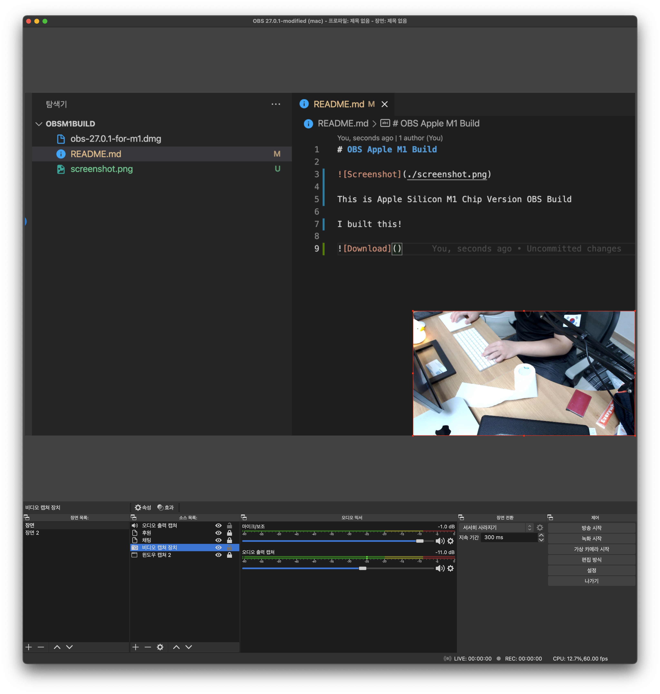
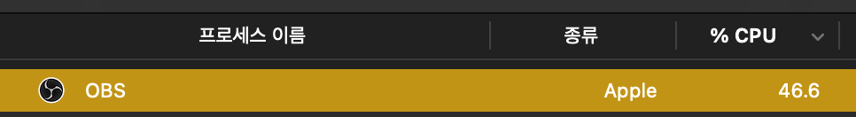
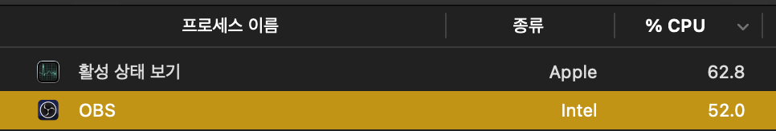

# OBS Apple M1 Build

This is Apple Silicon M1 Chip Version OBS Build

It really works!  
Successfully recognized as Apple Silicon!

And this is original OBS Studio 27.0.1  
It recognized as Intel App. Running on Rosetta

I changed to the Apple Silicon Version and I'm happy ~

I think there's a 5% improvement in performance.

[Download obs-27.0.1-for-m1.dmg](https://github.com/rhea-so/OBSM1Build/releases/download/27.0.1/obs-27.0.1-for-m1.dmg)